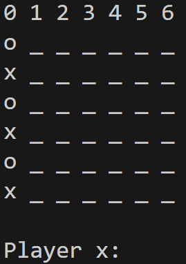
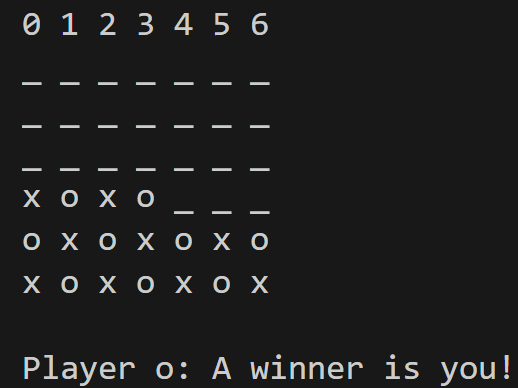

# Testprotokoll

## Fehler 1: Programmabsturz (Index out of Range)

### Zustand des Spielbretts zum Zeitpunkt des Fehlers

### Eingabe
- Wiederholte Eingabe von `0` (Spalte 0), auch nachdem die Spalte vollständig gefüllt ist.

### Beobachtetes Verhalten
- Das Programm stürzt mit einem **Index out of Range** Fehler ab.

### Erwartetes Verhalten
- Das Programm sollte eine volle Spalte erkennen und entweder:
  - den Zug ablehnen oder
  - keine Gewinnerprüfung durchführen
- In keinem Fall sollte das Programm abstürzen.

---

## Fehler 2: Falscher Gewinner bei Schachbrett-Muster

### Zustand des Spielbretts

### Eingabe
- Abwechselnde Spielzüge von Player X und Player O, sodass das oben dargestellte Schachbrett-Muster entsteht.

### Beobachtetes Verhalten
- Das Spiel meldet **Player O als Gewinner**, obwohl keine vier Steine in einer horizontalen, vertikalen oder diagonalen Reihe liegen.

### Erwartetes Verhalten
- Es darf **kein Gewinner** gemeldet werden.